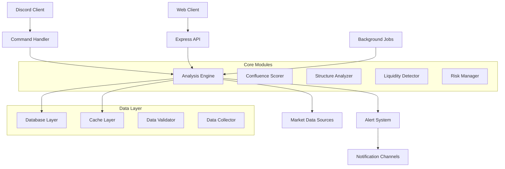

# Trading Bot Development Guide

This comprehensive guide provides developers with everything needed to contribute to, extend, and maintain the Trading Bot project.

## 📋 Table of Contents

- [Development Environment Setup](#development-environment-setup)
- [Project Architecture](#project-architecture)
- [Code Structure](#code-structure)
- [Development Workflow](#development-workflow)
- [Adding New Features](#adding-new-features)
- [Testing Guidelines](#testing-guidelines)
- [Code Quality Standards](#code-quality-standards)
- [API Development](#api-development)
- [Database Development](#database-development)
- [Performance Optimization](#performance-optimization)
- [Debugging & Profiling](#debugging--profiling)
- [Contributing Guidelines](#contributing-guidelines)

## 🛠️ Development Environment Setup

### Prerequisites

#### System Requirements
- **Node.js**: 18.0.0+ (LTS recommended)
- **npm**: 8.0.0+ or **yarn**: 1.22.0+
- **Git**: Latest version
- **Docker**: 20.0+ (optional, for containerized development)
- **VS Code**: Recommended IDE with extensions

#### Recommended VS Code Extensions
```json
{
  "recommendations": [
    "ms-vscode.vscode-typescript-next",
    "bradlc.vscode-tailwindcss",
    "ms-vscode.vscode-json",
    "esbenp.prettier-vscode",
    "ms-vscode.vscode-eslint",
    "ms-vscode-remote.remote-containers",
    "humao.rest-client",
    "ms-vscode.vscode-jest"
  ]
}
```

### Local Setup

#### 1. Repository Setup
```bash
# Clone repository
git clone https://github.com/your-org/trading-bot.git
cd trading-bot

# Install dependencies
npm install

# Copy environment configuration
cp .env.example .env.development
```

#### 2. Environment Configuration
```env
# .env.development
NODE_ENV=development
LOG_LEVEL=debug

# Discord Bot (use development bot)
DISCORD_TOKEN=your_dev_bot_token
DISCORD_CLIENT_ID=your_dev_client_id
DISCORD_GUILD_ID=your_dev_guild_id

# Database (local development)
DB_HOST=localhost
DB_PORT=5432
DB_NAME=trading_bot_dev
DB_USER=trading_bot_dev
DB_PASSWORD=dev_password

# Redis (local development)
REDIS_HOST=localhost
REDIS_PORT=6379
REDIS_PASSWORD=dev_redis_password

# Development specific
ENABLE_MOCK_DATA=true
MOCK_MARKET_DATA=true
DEBUG_MODE=true
```

#### 3. Database Setup
```bash
# Start PostgreSQL (via Docker)
docker run --name trading-bot-postgres \
  -e POSTGRES_DB=trading_bot_dev \
  -e POSTGRES_USER=trading_bot_dev \
  -e POSTGRES_PASSWORD=dev_password \
  -p 5432:5432 -d postgres:14

# Run migrations
npm run db:migrate

# Seed development data
npm run db:seed
```

#### 4. Redis Setup
```bash
# Start Redis (via Docker)
docker run --name trading-bot-redis \
  -p 6379:6379 \
  -d redis:7-alpine \
  redis-server --requirepass dev_redis_password
```

#### 5. Start Development Server
```bash
# Start in development mode
npm run dev

# Or with debugging
npm run dev:debug

# Run with file watching
npm run dev:watch
```

### Docker Development Environment

#### docker-compose.dev.yml
```yaml
version: '3.8'

services:
  trading-bot-dev:
    build:
      context: .
      dockerfile: Dockerfile
      target: development
    ports:
      - "3000:3000"
      - "9229:9229"  # Debug port
    environment:
      - NODE_ENV=development
      - DEBUG=trading-bot:*
    env_file:
      - .env.development
    volumes:
      - .:/app
      - /app/node_modules
    depends_on:
      - postgres-dev
      - redis-dev
    networks:
      - trading-bot-dev

  postgres-dev:
    image: postgres:14
    environment:
      POSTGRES_DB: trading_bot_dev
      POSTGRES_USER: trading_bot_dev
      POSTGRES_PASSWORD: dev_password
    ports:
      - "5432:5432"
    volumes:
      - postgres_dev_data:/var/lib/postgresql/data
    networks:
      - trading-bot-dev

  redis-dev:
    image: redis:7-alpine
    command: redis-server --requirepass dev_redis_password
    ports:
      - "6379:6379"
    networks:
      - trading-bot-dev

volumes:
  postgres_dev_data:

networks:
  trading-bot-dev:
    driver: bridge
```

#### Start Docker Development
```bash
# Start development environment
docker-compose -f docker-compose.dev.yml up -d

# View logs
docker-compose -f docker-compose.dev.yml logs -f trading-bot-dev

# Access container shell
docker-compose -f docker-compose.dev.yml exec trading-bot-dev sh
```

---

## 🏗️ Project Architecture

### High-Level Architecture



### Module Dependency Graph

```javascript
// Module dependencies visualization
const dependencies = {
  'bot/index.js': ['handlers/commandHandler.js', 'utils/logger.js'],
  'analysis/engine.js': [
    'analysis/confluence.js',
    'analysis/structure.js',
    'analysis/liquidity.js',
    'utils/math.js'
  ],
  'data/collector.js': [
    'data/sources/alphavantage.js',
    'data/sources/polygon.js',
    'data/validator.js'
  ],
  'alerts/manager.js': [
    'alerts/templates.js',
    'alerts/delivery.js',
    'utils/logger.js'
  ]
};
```

### Design Principles

#### 1. Separation of Concerns
- **Presentation Layer**: Discord bot commands, API endpoints
- **Business Logic Layer**: Trading analysis, confluence scoring
- **Data Access Layer**: Database operations, external API calls
- **Infrastructure Layer**: Logging, caching, error handling

#### 2. Dependency Injection
```javascript
// Example: Dependency injection pattern
class AnalysisEngine {
  constructor(dependencies = {}) {
    this.confluenceScorer = dependencies.confluenceScorer || new ConfluenceScorer();
    this.structureAnalyzer = dependencies.structureAnalyzer || new StructureAnalyzer();
    this.liquidityDetector = dependencies.liquidityDetector || new LiquidityDetector();
    this.dataCollector = dependencies.dataCollector || new DataCollector();
    this.logger = dependencies.logger || require('../utils/logger');
  }
}

// In tests or different environments
const mockEngine = new AnalysisEngine({
  dataCollector: new MockDataCollector(),
  logger: new TestLogger()
});
```

#### 3. Event-Driven Architecture
```javascript
// Event system for loose coupling
const EventEmitter = require('events');

class TradingEventBus extends EventEmitter {
  constructor() {
    super();
    this.setMaxListeners(50);
  }

  emitSignal(signal) {
    this.emit('trading:signal', signal);
  }

  emitAlert(alert) {
    this.emit('alert:triggered', alert);
  }

  emitError(error) {
    this.emit('error:occurred', error);
  }
}

module.exports = new TradingEventBus();
```

---

## 📁 Code Structure

### Directory Organization

```
src/
├── bot/                    # Discord bot implementation
│   ├── commands/          # Command implementations
│   │   ├── trading/       # Trading-specific commands
│   │   ├── utility/       # Utility commands
│   │   └── admin/         # Administrative commands
│   ├── handlers/          # Event and message handlers
│   ├── middleware/        # Bot middleware (permissions, rate limiting)
│   └── index.js          # Bot entry point
│
├── api/                   # REST API implementation
│   ├── routes/           # API route definitions
│   ├── middleware/       # API middleware
│   ├── controllers/      # Request controllers
│   └── index.js         # API server entry point
│
├── analysis/             # Trading analysis modules
│   ├── confluence.js     # Confluence scoring system
│   ├── structure.js      # Market structure analysis
│   ├── liquidity.js      # Liquidity analysis
│   ├── patterns.js       # Pattern recognition
│   └── engine.js         # Main analysis engine
│
├── data/                 # Data management
│   ├── sources/          # External data source integrations
│   ├── collector.js      # Data collection service
│   ├── storage.js        # Data storage layer
│   ├── validator.js      # Data validation
│   └── cache.js          # Caching strategies
│
├── database/             # Database layer
│   ├── models/           # Data models
│   ├── migrations/       # Database migrations
│   ├── seeds/           # Seed data
│   └── connection.js     # Database connection
│
├── alerts/               # Alert and notification system
│   ├── manager.js        # Alert management
│   ├── templates.js      # Alert templates
│   ├── delivery.js       # Alert delivery mechanisms
│   └── schedulers/       # Scheduled alert checks
│
├── utils/                # Utility modules
│   ├── logger.js         # Logging system
│   ├── errorHandler.js   # Error handling
│   ├── rateLimit.js      # Rate limiting
│   ├── math.js           # Mathematical utilities
│   ├── validation.js     # Input validation
│   └── helpers.js        # General helper functions
│
├── monitoring/           # System monitoring
│   ├── healthCheck.js    # Health check service
│   ├── metrics.js        # Metrics collection
│   └── performance.js    # Performance monitoring
│
├── config/               # Configuration management
│   ├── index.js          # Configuration loader
│   ├── development.js    # Development config
│   ├── production.js     # Production config
│   └── test.js          # Test config
│
└── types/                # TypeScript type definitions
    ├── api.d.ts          # API types
    ├── trading.d.ts      # Trading-specific types
    └── common.d.ts       # Common types
```

### File Naming Conventions

#### General Rules
- Use **camelCase** for files and directories
- Use **PascalCase** for classes and constructors
- Use **kebab-case** for command names
- Use **UPPER_SNAKE_CASE** for constants

#### Examples
```
✅ Good:
- analysisEngine.js
- ConfluenceScorer.js
- market-bias.js
- API_VERSION

❌ Bad:
- analysis_engine.js
- confluencescorer.js
- marketBias.js
- api_version
```

### Code Organization Patterns

#### 1. Module Structure Template
```javascript
/**
 * Module Name: Brief description
 *
 * @author Your Name
 * @version 1.0.0
 * @since 2024-01-01
 */

// External dependencies
const external1 = require('external-package');
const external2 = require('another-package');

// Internal dependencies
const internalModule = require('../internal/module');
const config = require('../../config');
const logger = require('../utils/logger');

// Constants
const CONSTANTS = {
  DEFAULT_VALUE: 100,
  MAX_RETRIES: 3
};

/**
 * Main class description
 */
class ModuleName {
  constructor(options = {}) {
    this.options = { ...CONSTANTS, ...options };
    this.logger = logger.child({ module: 'ModuleName' });
  }

  // Public methods
  async publicMethod(param1, param2) {
    try {
      this.logger.debug('Public method called', { param1, param2 });

      const result = await this._privateMethod(param1, param2);

      return result;
    } catch (error) {
      this.logger.error('Error in public method', error);
      throw error;
    }
  }

  // Private methods
  _privateMethod(param1, param2) {
    // Implementation
  }
}

// Export
module.exports = ModuleName;
```

#### 2. Command Structure Template
```javascript
// src/bot/commands/trading/example.js
const { EmbedBuilder } = require('discord.js');
const logger = require('../../utils/logger');
const { validatePair } = require('../../utils/validation');

module.exports = {
  // Command metadata
  name: 'example',
  aliases: ['ex'],
  description: 'Example command description',
  usage: '<required_param> [optional_param]',
  category: 'Trading',
  cooldown: 10000, // 10 seconds
  guildOnly: false,
  args: true,
  permissions: ['SEND_MESSAGES'],

  // Command execution
  async execute(message, args, client) {
    const startTime = Date.now();

    try {
      // Input validation
      if (!validatePair(args[0])) {
        return message.reply('❌ Invalid currency pair format');
      }

      // Command logic
      const result = await this.processCommand(args);

      // Response
      const embed = this.createResponseEmbed(result);
      await message.reply({ embeds: [embed] });

      // Logging
      logger.info('Command executed successfully', {
        command: this.name,
        user: message.author.tag,
        args,
        executionTime: Date.now() - startTime
      });

    } catch (error) {
      logger.error('Command execution failed', {
        command: this.name,
        user: message.author.tag,
        error: error.message,
        stack: error.stack
      });

      const errorEmbed = new EmbedBuilder()
        .setColor('#ff0000')
        .setTitle('❌ Command Error')
        .setDescription('An error occurred processing your request.')
        .setTimestamp();

      await message.reply({ embeds: [errorEmbed] });
    }
  },

  // Helper methods
  async processCommand(args) {
    // Command processing logic
  },

  createResponseEmbed(data) {
    return new EmbedBuilder()
      .setColor('#0099ff')
      .setTitle('Command Response')
      .setDescription('Response data')
      .setTimestamp();
  }
};
```

---

## 🔄 Development Workflow

### Git Workflow

#### Branch Strategy
```bash
main                    # Production-ready code
├── develop            # Integration branch for features
├── feature/*          # Feature development
├── bugfix/*           # Bug fixes
├── hotfix/*           # Emergency production fixes
└── release/*          # Release preparation
```

#### Feature Development Process
```bash
# 1. Start new feature
git checkout develop
git pull origin develop
git checkout -b feature/new-analysis-engine

# 2. Develop feature
git add .
git commit -m "feat: implement new analysis engine"

# 3. Push and create PR
git push origin feature/new-analysis-engine
gh pr create --title "Feature: New Analysis Engine" --base develop

# 4. After review and approval
git checkout develop
git pull origin develop
git branch -d feature/new-analysis-engine
```

#### Commit Message Format
```bash
# Format: type(scope): description

feat(analysis): add confluence scoring algorithm
fix(bot): resolve command cooldown issue
docs(api): update endpoint documentation
style(utils): format logger configuration
refactor(data): optimize database queries
test(analysis): add unit tests for confluence scorer
chore(deps): update dependencies
```

### Code Review Process

#### Review Checklist
- [ ] **Functionality**: Does the code work as intended?
- [ ] **Code Quality**: Is the code clean and well-structured?
- [ ] **Performance**: Are there any performance concerns?
- [ ] **Security**: Are there security vulnerabilities?
- [ ] **Tests**: Are there adequate tests?
- [ ] **Documentation**: Is the code properly documented?
- [ ] **Standards**: Does it follow project standards?

#### PR Template
```markdown
## Description
Brief description of changes made.

## Type of Change
- [ ] Bug fix (non-breaking change which fixes an issue)
- [ ] New feature (non-breaking change which adds functionality)
- [ ] Breaking change (fix or feature that would cause existing functionality to not work as expected)
- [ ] This change requires a documentation update

## How Has This Been Tested?
Describe the tests that you ran to verify your changes.

## Checklist:
- [ ] My code follows the style guidelines of this project
- [ ] I have performed a self-review of my own code
- [ ] I have commented my code, particularly in hard-to-understand areas
- [ ] I have made corresponding changes to the documentation
- [ ] My changes generate no new warnings
- [ ] I have added tests that prove my fix is effective or that my feature works
- [ ] New and existing unit tests pass locally with my changes
```

---

## 🆕 Adding New Features

### Adding a New Discord Command

#### 1. Create Command File
```javascript
// src/bot/commands/trading/newCommand.js
module.exports = {
  name: 'newcommand',
  aliases: ['nc'],
  description: 'Description of the new command',
  usage: '<param1> [param2]',
  category: 'Trading',
  cooldown: 15000,
  args: true,

  async execute(message, args, client) {
    // Implementation
  }
};
```

#### 2. Add Command Logic
```javascript
async execute(message, args, client) {
  try {
    // Validate input
    const param1 = args[0];
    if (!this.validateInput(param1)) {
      return message.reply('❌ Invalid input parameter');
    }

    // Process request
    const result = await this.processRequest(param1, args[1]);

    // Create response
    const embed = this.createEmbed(result);
    await message.reply({ embeds: [embed] });

  } catch (error) {
    logger.error('New command error:', error);
    await message.reply('❌ An error occurred processing your request.');
  }
}
```

#### 3. Add Tests
```javascript
// tests/bot/commands/newCommand.test.js
const newCommand = require('../../../src/bot/commands/trading/newCommand');

describe('New Command', () => {
  test('should validate input correctly', () => {
    expect(newCommand.validateInput('valid')).toBe(true);
    expect(newCommand.validateInput('')).toBe(false);
  });

  test('should process request successfully', async () => {
    const result = await newCommand.processRequest('test', 'optional');
    expect(result).toBeDefined();
  });
});
```

### Adding a New Analysis Module

#### 1. Create Analysis Module
```javascript
// src/analysis/newAnalyzer.js
class NewAnalyzer {
  constructor(options = {}) {
    this.options = {
      threshold: options.threshold || 0.5,
      lookback: options.lookback || 20,
      ...options
    };
  }

  analyze(data) {
    // Analysis implementation
    return {
      signal: 'buy' | 'sell' | 'neutral',
      strength: 1-10,
      confidence: 0-100,
      reasoning: ['reason1', 'reason2']
    };
  }

  _helperMethod(data) {
    // Helper method implementation
  }
}

module.exports = NewAnalyzer;
```

#### 2. Integrate with Analysis Engine
```javascript
// src/analysis/engine.js
const NewAnalyzer = require('./newAnalyzer');

class AnalysisEngine {
  constructor() {
    this.newAnalyzer = new NewAnalyzer();
    // ... other analyzers
  }

  async performAnalysis(data) {
    const results = {
      // ... existing analyses
      newAnalysis: await this.newAnalyzer.analyze(data)
    };

    return results;
  }
}
```

#### 3. Add Configuration
```javascript
// config/index.js
module.exports = {
  analysis: {
    newAnalyzer: {
      threshold: 0.6,
      lookback: 25,
      enabled: true
    }
  }
};
```

### Adding API Endpoints

#### 1. Create Route Handler
```javascript
// src/api/routes/newEndpoint.js
const express = require('express');
const { authenticate, validate } = require('../middleware');
const NewController = require('../controllers/newController');

const router = express.Router();
const controller = new NewController();

// GET /api/new-endpoint/:param
router.get('/:param',
  authenticate,
  validate.param('param').isString().notEmpty(),
  controller.handleGet.bind(controller)
);

// POST /api/new-endpoint
router.post('/',
  authenticate,
  validate.body('data').isObject(),
  controller.handlePost.bind(controller)
);

module.exports = router;
```

#### 2. Create Controller
```javascript
// src/api/controllers/newController.js
const logger = require('../../utils/logger');

class NewController {
  async handleGet(req, res) {
    try {
      const { param } = req.params;
      const result = await this.processGetRequest(param);

      res.json({
        status: 'success',
        data: result,
        meta: {
          timestamp: new Date().toISOString(),
          responseTime: `${Date.now() - req.startTime}ms`
        }
      });

    } catch (error) {
      logger.error('Controller error:', error);
      res.status(500).json({
        status: 'error',
        error: {
          message: 'Internal server error',
          code: 'INTERNAL_ERROR'
        }
      });
    }
  }

  async processGetRequest(param) {
    // Processing logic
  }
}

module.exports = NewController;
```

#### 3. Register Route
```javascript
// src/api/index.js
const newEndpointRoutes = require('./routes/newEndpoint');

app.use('/api/new-endpoint', newEndpointRoutes);
```

---

## 🧪 Testing Guidelines

### Testing Strategy

#### Test Pyramid
```
    /\    E2E Tests (Few)
   /  \
  /____\  Integration Tests (Some)
 /      \
/________\ Unit Tests (Many)
```

#### Test Categories

1. **Unit Tests**: Test individual functions/methods
2. **Integration Tests**: Test module interactions
3. **API Tests**: Test REST API endpoints
4. **E2E Tests**: Test complete user workflows

### Test Framework Setup

#### Jest Configuration
```javascript
// jest.config.js
module.exports = {
  testEnvironment: 'node',
  collectCoverage: true,
  coverageDirectory: 'coverage',
  coverageReporters: ['text', 'lcov', 'html'],
  coverageThreshold: {
    global: {
      branches: 80,
      functions: 80,
      lines: 80,
      statements: 80
    }
  },
  testMatch: [
    '**/tests/**/*.test.js',
    '**/src/**/__tests__/*.js'
  ],
  setupFilesAfterEnv: ['<rootDir>/tests/setup.js'],
  testTimeout: 30000
};
```

#### Test Setup
```javascript
// tests/setup.js
const logger = require('../src/utils/logger');

// Mock logger for tests
logger.level = 'silent';

// Global test helpers
global.sleep = (ms) => new Promise(resolve => setTimeout(resolve, ms));

// Database setup for tests
beforeAll(async () => {
  // Initialize test database
});

afterAll(async () => {
  // Cleanup test database
});
```

### Unit Testing Examples

#### Analysis Module Tests
```javascript
// tests/analysis/confluence.test.js
const ConfluenceScorer = require('../../src/analysis/confluence');

describe('ConfluenceScorer', () => {
  let scorer;

  beforeEach(() => {
    scorer = new ConfluenceScorer({
      tier1Weight: 3.0,
      tier2Weight: 2.0,
      tier3Weight: 1.0
    });
  });

  describe('calculateConfluenceScore', () => {
    test('should calculate score correctly with valid confluences', () => {
      const confluences = [
        {
          type: 'break_of_structure',
          price: 1.0850,
          strength: 8,
          timestamp: Date.now() - 3600000 // 1 hour ago
        },
        {
          type: 'order_block',
          price: 1.0848,
          strength: 7,
          timestamp: Date.now() - 1800000 // 30 minutes ago
        }
      ];

      const result = scorer.calculateConfluenceScore(
        1.0850,
        confluences,
        Date.now()
      );

      expect(result.finalScore).toBeGreaterThan(5);
      expect(result.rating.label).toBe('strong');
      expect(result.activeConfluences).toHaveLength(2);
    });

    test('should return empty score for no confluences', () => {
      const result = scorer.calculateConfluenceScore(1.0850, [], Date.now());

      expect(result.finalScore).toBe(0);
      expect(result.activeConfluences).toHaveLength(0);
    });
  });

  describe('_getConfluenceTier', () => {
    test('should return correct tier for known types', () => {
      expect(scorer._getConfluenceTier('break_of_structure')).toEqual({
        name: 'tier_1',
        weight: 3.0
      });

      expect(scorer._getConfluenceTier('order_block')).toEqual({
        name: 'tier_2',
        weight: 2.0
      });

      expect(scorer._getConfluenceTier('fibonacci_level')).toEqual({
        name: 'tier_3',
        weight: 1.0
      });
    });

    test('should return null for unknown types', () => {
      expect(scorer._getConfluenceTier('unknown_type')).toBeNull();
    });
  });
});
```

#### Command Tests
```javascript
// tests/bot/commands/bias.test.js
const biasCommand = require('../../../src/bot/commands/bias');

// Mock Discord.js
jest.mock('discord.js', () => ({
  EmbedBuilder: jest.fn().mockImplementation(() => ({
    setColor: jest.fn().mockReturnThis(),
    setTitle: jest.fn().mockReturnThis(),
    setDescription: jest.fn().mockReturnThis(),
    addFields: jest.fn().mockReturnThis(),
    setFooter: jest.fn().mockReturnThis(),
    setTimestamp: jest.fn().mockReturnThis()
  }))
}));

describe('Bias Command', () => {
  let mockMessage;

  beforeEach(() => {
    mockMessage = {
      reply: jest.fn(),
      author: {
        tag: 'testuser#1234',
        displayAvatarURL: jest.fn().mockReturnValue('https://avatar.url')
      }
    };
  });

  test('should validate currency pair format', () => {
    expect(biasCommand.isValidPair('EURUSD')).toBe(true);
    expect(biasCommand.isValidPair('GBPUSD')).toBe(true);
    expect(biasCommand.isValidPair('EUR')).toBe(false);
    expect(biasCommand.isValidPair('EURUSD123')).toBe(false);
  });

  test('should reply with error for invalid pair', async () => {
    await biasCommand.execute(mockMessage, ['INVALID'], null);

    expect(mockMessage.reply).toHaveBeenCalledWith(
      expect.stringContaining('valid currency pair')
    );
  });

  test('should process valid pair successfully', async () => {
    await biasCommand.execute(mockMessage, ['EURUSD'], null);

    expect(mockMessage.reply).toHaveBeenCalled();
  });
});
```

### Integration Testing

#### API Integration Tests
```javascript
// tests/integration/api.test.js
const request = require('supertest');
const app = require('../../src/api');

describe('API Integration Tests', () => {
  test('GET /health should return healthy status', async () => {
    const response = await request(app)
      .get('/health')
      .expect(200);

    expect(response.body.status).toBe('healthy');
    expect(response.body).toHaveProperty('uptime');
  });

  test('GET /api/bias/EURUSD should require authentication', async () => {
    await request(app)
      .get('/api/bias/EURUSD')
      .expect(401);
  });

  test('GET /api/bias/EURUSD with valid token should return bias data', async () => {
    const response = await request(app)
      .get('/api/bias/EURUSD')
      .set('Authorization', 'Bearer valid_token')
      .expect(200);

    expect(response.body.status).toBe('success');
    expect(response.body.data).toHaveProperty('bias');
    expect(response.body.data).toHaveProperty('strength');
  });
});
```

### Performance Testing

#### Load Testing with Artillery
```yaml
# tests/performance/load-test.yml
config:
  target: 'http://localhost:3000'
  phases:
    - duration: 60
      arrivalRate: 10
  http:
    timeout: 30

scenarios:
  - name: "API Load Test"
    flow:
      - get:
          url: "/health"
      - get:
          url: "/api/bias/EURUSD"
          headers:
            Authorization: "Bearer {{ $randomString() }}"
```

#### Memory Leak Detection
```javascript
// tests/performance/memory.test.js
const AnalysisEngine = require('../../src/analysis/engine');

describe('Memory Leak Tests', () => {
  test('should not leak memory during repeated analysis', async () => {
    const engine = new AnalysisEngine();
    const initialMemory = process.memoryUsage().heapUsed;

    // Run analysis 1000 times
    for (let i = 0; i < 1000; i++) {
      await engine.analyze({
        pair: 'EURUSD',
        data: generateMockData()
      });
    }

    global.gc(); // Force garbage collection
    const finalMemory = process.memoryUsage().heapUsed;
    const memoryIncrease = finalMemory - initialMemory;

    // Memory increase should be minimal (less than 50MB)
    expect(memoryIncrease).toBeLessThan(50 * 1024 * 1024);
  });
});
```

### Test Commands

```bash
# Run all tests
npm test

# Run tests with coverage
npm run test:coverage

# Run specific test file
npm test -- tests/analysis/confluence.test.js

# Run tests in watch mode
npm run test:watch

# Run integration tests only
npm run test:integration

# Run performance tests
npm run test:performance
```

---

## 🎨 Code Quality Standards

### ESLint Configuration

#### .eslintrc.js
```javascript
module.exports = {
  env: {
    node: true,
    es2022: true,
    jest: true
  },
  extends: [
    'eslint:recommended',
    'plugin:node/recommended',
    'plugin:security/recommended'
  ],
  plugins: ['security', 'node'],
  parserOptions: {
    ecmaVersion: 2022,
    sourceType: 'module'
  },
  rules: {
    // Code style
    'indent': ['error', 2],
    'quotes': ['error', 'single'],
    'semi': ['error', 'always'],
    'comma-dangle': ['error', 'never'],
    'no-trailing-spaces': 'error',
    'eol-last': ['error', 'always'],

    // Best practices
    'no-console': 'warn',
    'no-unused-vars': 'error',
    'no-var': 'error',
    'prefer-const': 'error',
    'arrow-function': 'prefer',

    // Security
    'security/detect-non-literal-regexp': 'error',
    'security/detect-object-injection': 'error',

    // Node.js specific
    'node/no-unpublished-require': 'off',
    'node/no-missing-require': 'error'
  }
};
```

### Prettier Configuration

#### .prettierrc
```json
{
  "singleQuote": true,
  "trailingComma": "none",
  "tabWidth": 2,
  "semi": true,
  "printWidth": 100,
  "arrowParens": "avoid",
  "endOfLine": "lf"
}
```

### Code Documentation Standards

#### JSDoc Examples
```javascript
/**
 * Calculates confluence score for a specific price level
 *
 * @param {number} targetPrice - The price level to analyze
 * @param {Array<Object>} confluences - Array of confluence objects
 * @param {number} [currentTime=Date.now()] - Current timestamp in milliseconds
 * @returns {Promise<Object>} Confluence score analysis
 *
 * @example
 * const score = await scorer.calculateConfluenceScore(
 *   1.0850,
 *   confluences,
 *   Date.now()
 * );
 * console.log(score.finalScore); // 8.5
 *
 * @throws {Error} When confluences array is invalid
 * @since 1.0.0
 */
async calculateConfluenceScore(targetPrice, confluences, currentTime = Date.now()) {
  // Implementation
}

/**
 * Configuration options for ConfluenceScorer
 * @typedef {Object} ConfluenceScorerOptions
 * @property {number} [tier1Weight=3.0] - Weight for Tier 1 confluences
 * @property {number} [tier2Weight=2.0] - Weight for Tier 2 confluences
 * @property {number} [tier3Weight=1.0] - Weight for Tier 3 confluences
 * @property {number} [minScore=5.0] - Minimum score threshold
 */
```

### Error Handling Standards

#### Error Classes
```javascript
// src/utils/errors.js
class TradingBotError extends Error {
  constructor(message, code, statusCode = 500) {
    super(message);
    this.name = 'TradingBotError';
    this.code = code;
    this.statusCode = statusCode;
  }
}

class ValidationError extends TradingBotError {
  constructor(message, field) {
    super(message, 'VALIDATION_ERROR', 400);
    this.field = field;
  }
}

class RateLimitError extends TradingBotError {
  constructor(retryAfter) {
    super('Rate limit exceeded', 'RATE_LIMIT_EXCEEDED', 429);
    this.retryAfter = retryAfter;
  }
}

module.exports = {
  TradingBotError,
  ValidationError,
  RateLimitError
};
```

#### Error Handling Pattern
```javascript
async function riskyOperation() {
  try {
    const result = await externalAPI.call();
    return result;
  } catch (error) {
    // Log the error
    logger.error('Risky operation failed', {
      error: error.message,
      stack: error.stack,
      context: 'riskyOperation'
    });

    // Transform to application error
    if (error.code === 'NETWORK_ERROR') {
      throw new TradingBotError(
        'External service unavailable',
        'SERVICE_UNAVAILABLE',
        503
      );
    }

    // Re-throw unknown errors
    throw error;
  }
}
```

---

## 🔍 Debugging & Profiling

### Debug Configuration

#### Debug Environment
```env
# .env.debug
NODE_ENV=development
DEBUG=trading-bot:*
LOG_LEVEL=debug
ENABLE_DEBUG_ENDPOINTS=true
```

#### Debug Utilities
```javascript
// src/utils/debug.js
const debug = require('debug');

const createDebugger = (namespace) => {
  return {
    log: debug(`trading-bot:${namespace}`),
    error: debug(`trading-bot:${namespace}:error`),
    performance: debug(`trading-bot:${namespace}:performance`)
  };
};

module.exports = createDebugger;
```

#### Usage in Code
```javascript
const createDebugger = require('../utils/debug');
const debug = createDebugger('analysis');

class AnalysisEngine {
  async analyze(data) {
    debug.log('Starting analysis for %s', data.pair);
    const start = Date.now();

    try {
      const result = await this.performAnalysis(data);

      debug.performance('Analysis completed in %dms', Date.now() - start);
      return result;
    } catch (error) {
      debug.error('Analysis failed: %s', error.message);
      throw error;
    }
  }
}
```

### Performance Profiling

#### Memory Profiling
```javascript
// src/utils/profiler.js
class MemoryProfiler {
  static profile(label) {
    const memUsage = process.memoryUsage();

    console.log(`[${label}] Memory Usage:`);
    console.log(`  RSS: ${Math.round(memUsage.rss / 1024 / 1024)}MB`);
    console.log(`  Heap Used: ${Math.round(memUsage.heapUsed / 1024 / 1024)}MB`);
    console.log(`  Heap Total: ${Math.round(memUsage.heapTotal / 1024 / 1024)}MB`);

    return memUsage;
  }

  static diff(before, after, label) {
    const heapDiff = after.heapUsed - before.heapUsed;
    console.log(`[${label}] Heap difference: ${Math.round(heapDiff / 1024)}KB`);
  }
}

// Usage
const before = MemoryProfiler.profile('Before Analysis');
await performAnalysis();
const after = MemoryProfiler.profile('After Analysis');
MemoryProfiler.diff(before, after, 'Analysis Memory Impact');
```

#### Performance Timing
```javascript
// src/utils/timer.js
class Timer {
  constructor(label) {
    this.label = label;
    this.start = process.hrtime.bigint();
    this.marks = new Map();
  }

  mark(label) {
    this.marks.set(label, process.hrtime.bigint());
  }

  end() {
    const end = process.hrtime.bigint();
    const duration = Number(end - this.start) / 1000000; // Convert to milliseconds

    console.log(`[${this.label}] Total time: ${duration.toFixed(2)}ms`);

    // Log marks
    let prev = this.start;
    for (const [label, time] of this.marks) {
      const segmentTime = Number(time - prev) / 1000000;
      console.log(`  ${label}: ${segmentTime.toFixed(2)}ms`);
      prev = time;
    }

    return duration;
  }
}

// Usage
const timer = new Timer('Analysis Pipeline');
timer.mark('Data Collection');
await collectData();
timer.mark('Analysis Processing');
await processAnalysis();
timer.mark('Result Formatting');
await formatResults();
timer.end();
```

### Debugging Tools

#### Debug Endpoints (Development Only)
```javascript
// src/api/routes/debug.js
const express = require('express');
const router = express.Router();

// Only enable in development
if (process.env.NODE_ENV === 'development' && process.env.ENABLE_DEBUG_ENDPOINTS) {

  // Memory usage
  router.get('/memory', (req, res) => {
    const usage = process.memoryUsage();
    res.json({
      memory: {
        rss: `${Math.round(usage.rss / 1024 / 1024)}MB`,
        heapUsed: `${Math.round(usage.heapUsed / 1024 / 1024)}MB`,
        heapTotal: `${Math.round(usage.heapTotal / 1024 / 1024)}MB`,
        external: `${Math.round(usage.external / 1024 / 1024)}MB`
      }
    });
  });

  // Force garbage collection
  router.post('/gc', (req, res) => {
    if (global.gc) {
      global.gc();
      res.json({ message: 'Garbage collection triggered' });
    } else {
      res.status(400).json({ error: 'GC not exposed. Start with --expose-gc flag' });
    }
  });

  // CPU usage
  router.get('/cpu', (req, res) => {
    const usage = process.cpuUsage();
    res.json({
      cpu: {
        user: usage.user,
        system: usage.system
      }
    });
  });
}

module.exports = router;
```

---

## 📚 Contributing Guidelines

### Getting Started

#### 1. Fork and Clone
```bash
# Fork the repository on GitHub
# Then clone your fork
git clone https://github.com/your-username/trading-bot.git
cd trading-bot

# Add upstream remote
git remote add upstream https://github.com/original-owner/trading-bot.git
```

#### 2. Set Up Development Environment
```bash
# Install dependencies
npm install

# Set up pre-commit hooks
npm run prepare

# Run tests to ensure everything works
npm test
```

### Development Guidelines

#### Code Standards
1. **Follow existing code style** - Use ESLint and Prettier
2. **Write comprehensive tests** - Maintain high test coverage
3. **Document your code** - Use JSDoc for public APIs
4. **Handle errors gracefully** - Use proper error handling patterns
5. **Optimize for performance** - Consider memory and CPU usage

#### Pull Request Process

1. **Create Feature Branch**
   ```bash
   git checkout -b feature/your-feature-name
   ```

2. **Make Changes**
   - Write code following project standards
   - Add tests for new functionality
   - Update documentation as needed

3. **Test Changes**
   ```bash
   npm test
   npm run lint
   npm run test:coverage
   ```

4. **Commit Changes**
   ```bash
   git add .
   git commit -m "feat: add new feature description"
   ```

5. **Push and Create PR**
   ```bash
   git push origin feature/your-feature-name
   # Create PR on GitHub
   ```

### Code of Conduct

#### Our Standards
- **Be respectful** and inclusive in all interactions
- **Be constructive** in code reviews and discussions
- **Be patient** with new contributors
- **Be professional** in all communications

#### Reporting Issues
- Use clear, descriptive titles
- Provide detailed reproduction steps
- Include system information and logs
- Be responsive to requests for clarification

### Recognition

Contributors will be recognized in:
- Project README
- Release notes
- Contributors page
- Special recognition for major contributions

---

## 📞 Support

### Development Support Channels
- **GitHub Issues**: Report bugs and request features
- **Discord**: Join our development channel for real-time help
- **Email**: dev-support@trading-bot.com
- **Documentation**: Check our comprehensive docs

### Getting Help

#### Before Asking for Help
1. Check existing documentation
2. Search GitHub issues
3. Review the FAQ
4. Try debugging with provided tools

#### When Asking for Help
1. Provide clear problem description
2. Include relevant code snippets
3. Share error messages and logs
4. Describe what you've already tried

---

## 📝 Development Checklist

### New Feature Checklist
- [ ] Feature branch created from `develop`
- [ ] Code follows project standards
- [ ] Tests written and passing
- [ ] Documentation updated
- [ ] Performance impact assessed
- [ ] Security implications considered
- [ ] Error handling implemented
- [ ] Logging added where appropriate
- [ ] Code reviewed by team member
- [ ] Integration tests passing
- [ ] Ready for production deployment

### Release Checklist
- [ ] All tests passing
- [ ] Documentation up to date
- [ ] Version number updated
- [ ] Change log updated
- [ ] Security scan completed
- [ ] Performance benchmarks run
- [ ] Database migrations tested
- [ ] Rollback plan prepared
- [ ] Monitoring alerts configured
- [ ] Team notified of deployment

---

*This development guide is a living document. Please contribute improvements and updates as the project evolves.*