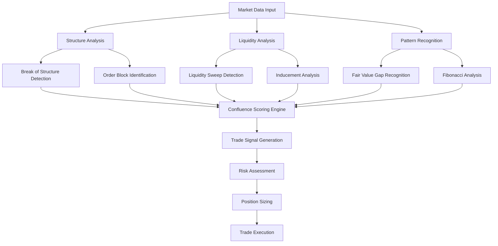

# Trading Methodology Guide

This comprehensive guide explains the unified trading framework implemented in the Trading Bot, based on institutional-grade analysis techniques and Smart Money Concepts (SMC).

## 📋 Table of Contents

- [Trading Philosophy](#trading-philosophy)
- [Unified Trading Framework](#unified-trading-framework)
- [Smart Money Concepts](#smart-money-concepts)
- [Confluence Scoring System](#confluence-scoring-system)
- [Market Structure Analysis](#market-structure-analysis)
- [Liquidity Analysis](#liquidity-analysis)
- [Risk Management Framework](#risk-management-framework)
- [Multi-Timeframe Analysis](#multi-timeframe-analysis)
- [Pattern Recognition](#pattern-recognition)
- [Trade Setup Identification](#trade-setup-identification)
- [Implementation Examples](#implementation-examples)

## 🎯 Trading Philosophy

### Core Principles

The Trading Bot is built on the foundation that **institutional money moves markets**. Our approach focuses on identifying and following the "Smart Money" - the institutional traders, central banks, and large financial entities that drive price movements.

#### Key Beliefs
1. **Price follows liquidity**: Markets move to capture liquidity pools
2. **Structure governs direction**: Market structure changes signal trend shifts
3. **Confluence increases probability**: Multiple confirming factors improve trade success
4. **Risk management is paramount**: Preserve capital above all else
5. **Patience beats frequency**: Quality setups over quantity

#### Market Participants Hierarchy
```
1. Central Banks & Government Institutions
   ├── Primary influence on currency direction
   └── Policy decisions create long-term trends

2. Large Investment Banks & Hedge Funds
   ├── Create intermediate-term price movements
   └── Generate liquidity and order flow

3. Retail Aggregators & Prop Firms
   ├── Provide liquidity through aggregated retail flow
   └── Often used as counter-party by institutions

4. Individual Retail Traders
   ├── Provide liquidity to larger participants
   └── Often positioned opposite to institutional flow
```

---

## 🔄 Unified Trading Framework

### Framework Overview

Our unified framework integrates multiple analytical approaches into a cohesive methodology:



### Three-Tier Analysis System

#### Tier 1: Primary Confluences (Weight: 3.0x)
High-impact factors that significantly influence price movement:
- **Break of Structure (BOS)**: Definitive trend change signals
- **Liquidity Sweeps**: Institutional stop hunting activity
- **Session Manipulation**: Opening session false moves
- **Inducement**: Fake-out moves designed to trap retail traders

#### Tier 2: Secondary Confluences (Weight: 2.0x)
Important supporting factors for trade validation:
- **Fair Value Gaps (FVG)**: Imbalanced price areas
- **Order Blocks**: Institutional order placement zones
- **Inverse Fair Value Gaps (IFVG)**: Reversed imbalance zones
- **SMT Divergence**: Multi-asset divergence analysis
- **Breaker Blocks**: Failed order blocks turned support/resistance

#### Tier 3: Supporting Confluences (Weight: 1.0x)
Additional confirmation factors:
- **Equilibrium Levels**: 50% retracement zones
- **Fibonacci Levels**: Key retracement and extension levels
- **Psychological Levels**: Round number support/resistance
- **Trend Lines**: Classical technical analysis lines
- **Support/Resistance**: Traditional price levels

---

## 💡 Smart Money Concepts

### Break of Structure (BOS)

**Definition**: A break of structure occurs when price decisively breaks through a significant high or low, indicating a potential trend change.

#### Bullish BOS Identification
```
Criteria:
1. Price breaks above previous significant high
2. Close above the high with strong momentum
3. Volume confirmation (if available)
4. No immediate pullback below the broken level

Visual Pattern:
      ↗ New High (BOS)
     /
    /
   /  ← Previous High
  /
 /
```

#### Bearish BOS Identification
```
Criteria:
1. Price breaks below previous significant low
2. Close below the low with strong momentum
3. Volume confirmation (if available)
4. No immediate bounce above the broken level

Visual Pattern:
\
 \
  \
   \ ← Previous Low
    \
     \
      ↘ New Low (BOS)
```

#### BOS Implementation
```javascript
class BreakOfStructureDetector {
    detectBOS(priceData, lookback = 20) {
        const significantLevels = this.findSignificantLevels(priceData, lookback);
        const currentPrice = priceData[priceData.length - 1];

        // Check for bullish BOS
        const recentHigh = Math.max(...priceData.slice(-lookback).map(p => p.high));
        if (currentPrice.close > recentHigh * 1.001) { // 0.1% buffer
            return {
                type: 'bullish_bos',
                level: recentHigh,
                strength: this.calculateBOSStrength(currentPrice, recentHigh),
                timestamp: currentPrice.timestamp
            };
        }

        // Check for bearish BOS
        const recentLow = Math.min(...priceData.slice(-lookback).map(p => p.low));
        if (currentPrice.close < recentLow * 0.999) { // 0.1% buffer
            return {
                type: 'bearish_bos',
                level: recentLow,
                strength: this.calculateBOSStrength(currentPrice, recentLow),
                timestamp: currentPrice.timestamp
            };
        }

        return null;
    }
}
```

### Order Blocks

**Definition**: Order blocks are areas where institutional traders place large orders, creating zones of potential support or resistance.

#### Order Block Characteristics
1. **High Volume Zones**: Areas with significant trading activity
2. **Rejection Zones**: Price areas where reversals occur
3. **Institutional Footprint**: Evidence of large order execution
4. **Fresh vs. Tested**: Untested blocks are more reliable

#### Order Block Identification Algorithm
```javascript
class OrderBlockDetector {
    identifyOrderBlocks(priceData, volumeData) {
        const orderBlocks = [];

        for (let i = 2; i < priceData.length - 2; i++) {
            const current = priceData[i];
            const volume = volumeData[i];

            // High volume criterion
            if (this.isHighVolume(volume, volumeData, i)) {
                // Look for reversal pattern
                if (this.isReversalCandle(priceData, i)) {
                    const orderBlock = {
                        type: current.close > current.open ? 'bullish' : 'bearish',
                        high: current.high,
                        low: current.low,
                        volume: volume,
                        timestamp: current.timestamp,
                        strength: this.calculateOrderBlockStrength(priceData, i),
                        tested: false
                    };

                    orderBlocks.push(orderBlock);
                }
            }
        }

        return orderBlocks;
    }

    isHighVolume(volume, volumeData, index, lookback = 20) {
        const avgVolume = this.calculateAverage(
            volumeData.slice(Math.max(0, index - lookback), index)
        );
        return volume > avgVolume * 1.5; // 50% above average
    }
}
```

### Fair Value Gaps (FVG)

**Definition**: Fair Value Gaps occur when there's an imbalance in price action, creating areas where price is likely to return for "fair value" equilibrium.

#### FVG Formation Criteria
1. **Three-Candle Pattern**: Gap formed between three consecutive candles
2. **No Overlap**: The middle candle doesn't overlap with the other two
3. **Direction Bias**: Aligns with the prevailing trend direction

#### FVG Detection Implementation
```javascript
class FairValueGapDetector {
    detectFVG(priceData) {
        const fvgs = [];

        for (let i = 2; i < priceData.length; i++) {
            const candle1 = priceData[i - 2];
            const candle2 = priceData[i - 1]; // Gap candle
            const candle3 = priceData[i];

            // Bullish FVG: Gap between candle1.high and candle3.low
            if (candle1.high < candle3.low) {
                fvgs.push({
                    type: 'bullish_fvg',
                    upper: candle3.low,
                    lower: candle1.high,
                    timestamp: candle2.timestamp,
                    filled: false,
                    strength: this.calculateFVGStrength(candle1, candle2, candle3)
                });
            }

            // Bearish FVG: Gap between candle1.low and candle3.high
            if (candle1.low > candle3.high) {
                fvgs.push({
                    type: 'bearish_fvg',
                    upper: candle1.low,
                    lower: candle3.high,
                    timestamp: candle2.timestamp,
                    filled: false,
                    strength: this.calculateFVGStrength(candle1, candle2, candle3)
                });
            }
        }

        return fvgs;
    }
}
```

---

## 🏆 Confluence Scoring System

The confluence scoring system is the heart of our trading methodology, providing objective measurement of trade setup quality.

### Scoring Algorithm

#### Base Score Calculation
```javascript
class ConfluenceScorer {
    calculateConfluenceScore(targetPrice, confluences, currentTime) {
        let totalScore = 0;
        const activeConfluences = [];

        confluences.forEach(confluence => {
            const analysis = this.analyzeConfluence(confluence, targetPrice, currentTime);

            if (analysis.isActive) {
                totalScore += analysis.weightedScore;
                activeConfluences.push({
                    ...confluence,
                    analysis
                });
            }
        });

        // Apply probability weighting
        const probabilityScore = this.calculateProbabilityWeighting(
            totalScore,
            activeConfluences
        );

        return {
            targetPrice,
            rawScore: totalScore,
            probabilityScore,
            finalScore: probabilityScore,
            rating: this.getScoreRating(probabilityScore),
            confluenceCount: activeConfluences.length,
            activeConfluences
        };
    }
}
```

#### Weighting System
```javascript
const CONFLUENCE_TIERS = {
    TIER_1: {
        weight: 3.0,
        types: [
            'break_of_structure',
            'liquidity_sweep',
            'session_manipulation',
            'inducement'
        ]
    },
    TIER_2: {
        weight: 2.0,
        types: [
            'fair_value_gap',
            'order_block',
            'inverse_fair_value_gap',
            'smt_divergence',
            'breaker_block'
        ]
    },
    TIER_3: {
        weight: 1.0,
        types: [
            'equilibrium',
            'fibonacci_level',
            'psychological_level',
            'trend_line',
            'support_resistance'
        ]
    }
};
```

### Distance and Time Decay

#### Distance Weighting
Confluences closer to the target price receive higher scores:
```javascript
calculateDistanceWeight(confluence, targetPrice, maxDistance = 0.01) {
    const distance = Math.abs(confluence.price - targetPrice) / targetPrice;

    if (distance > maxDistance) {
        return 0; // Too far to be relevant
    }

    return Math.max(0, 1 - (distance / maxDistance));
}
```

#### Time Decay
Fresher confluences are more reliable:
```javascript
calculateTimeWeight(confluenceAge, maxAge = 48 * 60 * 60 * 1000, decayFactor = 0.3) {
    if (confluenceAge > maxAge) {
        return 0.2; // Minimum weight for very old confluences
    }

    return Math.max(0.2, 1 - (confluenceAge / maxAge) * decayFactor);
}
```

### Score Rating System

```javascript
const SCORE_RATINGS = {
    WEAK: { min: 0, max: 5.0, label: 'weak' },
    MODERATE: { min: 5.0, max: 8.0, label: 'moderate' },
    STRONG: { min: 8.0, max: 12.0, label: 'strong' },
    EXTREME: { min: 12.0, max: Infinity, label: 'extreme' }
};
```

#### Quality Assessment Matrix

| Score Range | Quality Level | Trading Action | Risk Level |
|-------------|---------------|----------------|------------|
| 0.0 - 5.0   | Weak         | Avoid         | Very High  |
| 5.0 - 8.0   | Moderate     | Consider      | High       |
| 8.0 - 12.0  | Strong       | Execute       | Moderate   |
| 12.0+       | Extreme      | High Priority | Low        |

---

## 📊 Market Structure Analysis

### Market Phases

#### 1. Accumulation Phase
- **Characteristics**: Sideways movement, low volatility
- **Institutional Activity**: Building positions quietly
- **Retail Behavior**: Often impatient, seeking breakouts
- **Trading Strategy**: Wait for distribution phase

#### 2. Markup/Distribution Phase
- **Characteristics**: Trending movement, higher volatility
- **Institutional Activity**: Moving price to target levels
- **Retail Behavior**: Chasing momentum
- **Trading Strategy**: Follow the trend with confluence confirmation

#### 3. Distribution Phase
- **Characteristics**: Choppy movement, mixed signals
- **Institutional Activity**: Offloading positions to retail
- **Retail Behavior**: FOMO buying at tops
- **Trading Strategy**: Prepare for reversal, reduce position sizes

### Market Structure Algorithm

```javascript
class MarketStructureAnalyzer {
    analyzeMarketStructure(priceData, period = 100) {
        const highs = this.findSignificantHighs(priceData, period);
        const lows = this.findSignificantLows(priceData, period);

        const structure = {
            trend: this.determineTrend(highs, lows),
            phase: this.identifyMarketPhase(priceData, period),
            keyLevels: this.identifyKeyLevels(highs, lows),
            strength: this.calculateTrendStrength(priceData, period)
        };

        return structure;
    }

    determineTrend(highs, lows) {
        // Higher Highs and Higher Lows = Uptrend
        if (this.isHigherHighs(highs) && this.isHigherLows(lows)) {
            return 'uptrend';
        }

        // Lower Highs and Lower Lows = Downtrend
        if (this.isLowerHighs(highs) && this.isLowerLows(lows)) {
            return 'downtrend';
        }

        // Mixed signals = Sideways
        return 'sideways';
    }

    identifyMarketPhase(priceData, period) {
        const volatility = this.calculateVolatility(priceData, period);
        const avgVolatility = this.calculateAverageVolatility(priceData, period * 2);
        const volume = this.getAverageVolume(priceData, period);

        if (volatility < avgVolatility * 0.7 && volume < 0.8) {
            return 'accumulation';
        } else if (volatility > avgVolatility * 1.3) {
            return 'markup_distribution';
        } else {
            return 'distribution';
        }
    }
}
```

---

## 💧 Liquidity Analysis

### Liquidity Pool Identification

Liquidity pools are areas where stop losses and pending orders cluster, creating zones that institutional traders target.

#### Common Liquidity Zones
1. **Previous Day/Week/Month Highs/Lows**
2. **Equal Highs/Lows (Double Tops/Bottoms)**
3. **Round Number Levels (1.0000, 1.1000, etc.)**
4. **Swing Highs/Lows in Trending Markets**
5. **Breakout Points with Failed Follow-Through**

### Liquidity Sweep Detection

```javascript
class LiquiditySweepDetector {
    detectLiquiditySweep(priceData, liquidityLevels) {
        const sweeps = [];

        for (let i = 1; i < priceData.length; i++) {
            const currentCandle = priceData[i];
            const previousCandle = priceData[i - 1];

            liquidityLevels.forEach(level => {
                // Check for liquidity sweep above resistance
                if (this.isSweepAbove(currentCandle, previousCandle, level)) {
                    sweeps.push({
                        type: 'sweep_above',
                        level: level.price,
                        timestamp: currentCandle.timestamp,
                        strength: this.calculateSweepStrength(currentCandle, level),
                        followThrough: this.hasFollowThrough(priceData, i, 'bearish')
                    });
                }

                // Check for liquidity sweep below support
                if (this.isSweepBelow(currentCandle, previousCandle, level)) {
                    sweeps.push({
                        type: 'sweep_below',
                        level: level.price,
                        timestamp: currentCandle.timestamp,
                        strength: this.calculateSweepStrength(currentCandle, level),
                        followThrough: this.hasFollowThrough(priceData, i, 'bullish')
                    });
                }
            });
        }

        return sweeps;
    }

    isSweepAbove(current, previous, level) {
        return (
            current.high > level.price &&          // Price swept above
            current.close < level.price &&        // But closed below
            previous.high <= level.price           // Previous candle didn't reach
        );
    }

    isSweepBelow(current, previous, level) {
        return (
            current.low < level.price &&           // Price swept below
            current.close > level.price &&        // But closed above
            previous.low >= level.price            // Previous candle didn't reach
        );
    }
}
```

### Inducement Patterns

Inducement is when smart money creates false moves to trap retail traders before moving in the intended direction.

#### Inducement Identification
```javascript
class InducementDetector {
    detectInducement(priceData, structuralLevels) {
        const inducements = [];

        for (let level of structuralLevels) {
            const breakoutIndex = this.findBreakout(priceData, level);

            if (breakoutIndex !== -1) {
                const reversalIndex = this.findReversal(
                    priceData,
                    breakoutIndex,
                    level.type
                );

                if (reversalIndex !== -1) {
                    inducements.push({
                        type: level.type === 'resistance' ? 'bearish_inducement' : 'bullish_inducement',
                        level: level.price,
                        breakoutTime: priceData[breakoutIndex].timestamp,
                        reversalTime: priceData[reversalIndex].timestamp,
                        strength: this.calculateInducementStrength(
                            priceData,
                            breakoutIndex,
                            reversalIndex
                        )
                    });
                }
            }
        }

        return inducements;
    }
}
```

---

## ⚖️ Risk Management Framework

### Position Sizing Algorithm

```javascript
class RiskManager {
    calculatePositionSize(accountBalance, riskPercentage, entryPrice, stopLoss) {
        const riskAmount = accountBalance * (riskPercentage / 100);
        const pointsAtRisk = Math.abs(entryPrice - stopLoss);
        const positionSize = riskAmount / pointsAtRisk;

        return {
            positionSize: Math.floor(positionSize),
            riskAmount,
            pointsAtRisk,
            riskPercentage
        };
    }

    assessTradeRisk(confluenceScore, marketContext) {
        let riskScore = 0;

        // Lower risk with higher confluence scores
        riskScore += Math.max(0, (12.0 - confluenceScore.finalScore) / 12.0) * 0.4;

        // Higher risk with fewer confluences
        riskScore += Math.max(0, (5 - confluenceScore.confluenceCount) / 5) * 0.3;

        // Market context adjustments
        if (marketContext.volatility === 'high') riskScore += 0.2;
        if (marketContext.trend === 'sideways') riskScore += 0.1;

        return {
            score: Math.min(riskScore, 1),
            level: riskScore < 0.3 ? 'low' : riskScore < 0.6 ? 'medium' : 'high',
            recommendedRisk: this.getRecommendedRiskPercentage(riskScore)
        };
    }

    getRecommendedRiskPercentage(riskScore) {
        if (riskScore < 0.3) return 2.0;      // Low risk: 2%
        if (riskScore < 0.6) return 1.5;      // Medium risk: 1.5%
        return 1.0;                           // High risk: 1%
    }
}
```

### Risk-Reward Optimization

#### Minimum Risk-Reward Ratios by Setup Quality

| Confluence Score | Minimum R:R | Recommended R:R | Max Risk % |
|------------------|-------------|-----------------|------------|
| 12.0+           | 1:1.5       | 1:3.0          | 2.0%       |
| 8.0 - 11.9      | 1:2.0       | 1:3.5          | 1.5%       |
| 5.0 - 7.9       | 1:2.5       | 1:4.0          | 1.0%       |
| < 5.0           | No Trade    | No Trade       | 0%         |

---

## ⏱️ Multi-Timeframe Analysis

### Timeframe Hierarchy

```javascript
const TIMEFRAME_HIERARCHY = {
    primary: ['1D', '4H'],      // Trend identification
    secondary: ['1H', '30M'],    // Entry refinement
    execution: ['15M', '5M']     // Precise entry timing
};
```

### Multi-Timeframe Confluence Calculation

```javascript
class MultiTimeframeAnalyzer {
    calculateMultiTimeframeConfluence(multiTimeframeConfluences, targetPrice) {
        const timeframes = Object.keys(multiTimeframeConfluences);
        const timeframeScores = {};
        let totalScore = 0;

        timeframes.forEach(timeframe => {
            const confluences = multiTimeframeConfluences[timeframe];
            const score = this.confluenceScorer.calculateConfluenceScore(
                targetPrice,
                confluences
            );

            if (score.finalScore > 0) {
                const timeframeWeight = this.getTimeframeWeight(timeframe);
                const weightedScore = score.finalScore * timeframeWeight;

                timeframeScores[timeframe] = {
                    ...score,
                    weight: timeframeWeight,
                    weightedScore
                };

                totalScore += weightedScore;
            }
        });

        const alignment = this.calculateTimeframeAlignment(timeframeScores);

        return {
            targetPrice,
            totalScore,
            timeframeScores,
            alignment,
            rating: this.getScoreRating(totalScore)
        };
    }

    getTimeframeWeight(timeframe) {
        const weights = {
            '1M': 0.3,
            '5M': 0.5,
            '15M': 0.7,
            '30M': 0.8,
            '1H': 1.0,
            '4H': 1.2,
            '1D': 1.5,
            '1W': 1.3
        };

        return weights[timeframe] || 1.0;
    }
}
```

---

## 🔍 Pattern Recognition

### Advanced Pattern Detection

#### Algorithmic Pattern Recognition
```javascript
class PatternRecognizer {
    recognizePatterns(priceData, windowSize = 50) {
        const patterns = [];

        // Flag patterns
        patterns.push(...this.detectFlags(priceData, windowSize));

        // Triangle patterns
        patterns.push(...this.detectTriangles(priceData, windowSize));

        // Reversal patterns
        patterns.push(...this.detectReversals(priceData, windowSize));

        return patterns;
    }

    detectFlags(priceData, windowSize) {
        const flags = [];

        for (let i = windowSize; i < priceData.length - windowSize; i++) {
            const leftData = priceData.slice(i - windowSize, i);
            const flagData = priceData.slice(i, i + 20); // 20-period flag

            // Check for strong trend before flag
            if (this.hasStrongTrend(leftData)) {
                const flagPattern = this.analyzeFlagPattern(flagData);

                if (flagPattern.isValid) {
                    flags.push({
                        type: 'flag',
                        direction: flagPattern.direction,
                        startIndex: i,
                        endIndex: i + 20,
                        strength: flagPattern.strength,
                        projectedTarget: this.calculateFlagTarget(leftData, flagData)
                    });
                }
            }
        }

        return flags;
    }
}
```

---

## 🎯 Trade Setup Identification

### Setup Classification System

```javascript
class TradeSetupClassifier {
    classifySetup(priceData, confluenceScore, marketStructure) {
        const setup = {
            type: null,
            direction: null,
            quality: confluenceScore.rating.label,
            entry: null,
            stopLoss: null,
            takeProfit: null,
            riskReward: null
        };

        // Determine setup type based on market conditions
        if (marketStructure.trend === 'uptrend') {
            if (confluenceScore.targetPrice < priceData[priceData.length - 1].close) {
                setup.type = 'pullback_buy';
                setup.direction = 'long';
            } else {
                setup.type = 'breakout_buy';
                setup.direction = 'long';
            }
        } else if (marketStructure.trend === 'downtrend') {
            if (confluenceScore.targetPrice > priceData[priceData.length - 1].close) {
                setup.type = 'pullback_sell';
                setup.direction = 'short';
            } else {
                setup.type = 'breakout_sell';
                setup.direction = 'short';
            }
        } else {
            setup.type = 'range_reversal';
            setup.direction = this.determineRangeDirection(
                confluenceScore,
                marketStructure
            );
        }

        // Calculate entry, stop loss, and take profit
        this.calculateEntryLevels(setup, confluenceScore, marketStructure);

        return setup;
    }
}
```

### Entry Timing Optimization

#### Precise Entry Techniques
1. **Market Order Execution**: Immediate entry at market price
2. **Limit Order Placement**: Entry at specific confluence level
3. **Stop Order Triggers**: Entry on breakout confirmation
4. **Time-Based Entries**: Entry during specific sessions

```javascript
class EntryTimingOptimizer {
    optimizeEntryTiming(setup, currentMarketData, sessionInfo) {
        const recommendations = [];

        // Session-based timing
        if (sessionInfo.isHighVolatilitySession()) {
            recommendations.push({
                method: 'market_order',
                reason: 'High volatility session - immediate execution preferred',
                priority: 1
            });
        } else {
            recommendations.push({
                method: 'limit_order',
                price: setup.entry,
                reason: 'Lower volatility - wait for precise level',
                priority: 2
            });
        }

        // Confluence-based timing
        if (setup.quality === 'extreme') {
            recommendations.push({
                method: 'aggressive_entry',
                reason: 'Extremely high confluence score warrants aggressive entry',
                priority: 1
            });
        }

        return recommendations.sort((a, b) => a.priority - b.priority);
    }
}
```

---

## 🛠️ Implementation Examples

### Complete Trading Signal Generation

```javascript
class TradingSignalGenerator {
    async generateSignal(pair, timeframe) {
        try {
            // 1. Collect market data
            const priceData = await this.dataCollector.getPriceData(pair, timeframe);
            const volumeData = await this.dataCollector.getVolumeData(pair, timeframe);

            // 2. Analyze market structure
            const marketStructure = this.structureAnalyzer.analyze(priceData);

            // 3. Identify confluences
            const confluences = await this.findAllConfluences(
                priceData,
                volumeData,
                timeframe
            );

            // 4. Calculate confluence score
            const currentPrice = priceData[priceData.length - 1].close;
            const confluenceScore = this.confluenceScorer.calculateConfluenceScore(
                currentPrice,
                confluences,
                Date.now()
            );

            // 5. Generate trade setup if score is sufficient
            if (confluenceScore.finalScore >= 5.0) {
                const setup = this.setupClassifier.classifySetup(
                    priceData,
                    confluenceScore,
                    marketStructure
                );

                // 6. Calculate risk assessment
                const riskAssessment = this.riskManager.assessTradeRisk(
                    confluenceScore,
                    marketStructure
                );

                // 7. Generate final signal
                return {
                    pair,
                    timeframe,
                    signal: setup.direction,
                    type: setup.type,
                    entry: setup.entry,
                    stopLoss: setup.stopLoss,
                    takeProfit: setup.takeProfit,
                    riskReward: setup.riskReward,
                    confluenceScore: confluenceScore.finalScore,
                    quality: confluenceScore.rating.label,
                    riskLevel: riskAssessment.level,
                    confidence: this.calculateConfidence(confluenceScore, riskAssessment),
                    reasoning: this.generateReasoning(confluenceScore, marketStructure)
                };
            }

            return null; // No signal generated

        } catch (error) {
            console.error('Error generating trading signal:', error);
            throw error;
        }
    }

    async findAllConfluences(priceData, volumeData, timeframe) {
        const confluences = [];

        // Structure-based confluences
        confluences.push(...this.bosDetector.detect(priceData));
        confluences.push(...this.orderBlockDetector.detect(priceData, volumeData));

        // Pattern-based confluences
        confluences.push(...this.fvgDetector.detect(priceData));
        confluences.push(...this.fibonacciAnalyzer.analyze(priceData));

        // Liquidity-based confluences
        confluences.push(...this.liquidityDetector.detect(priceData));
        confluences.push(...this.inducementDetector.detect(priceData));

        return confluences;
    }
}
```

### Example Signal Output

```json
{
  "pair": "EURUSD",
  "timeframe": "1H",
  "signal": "long",
  "type": "pullback_buy",
  "entry": 1.0845,
  "stopLoss": 1.0825,
  "takeProfit": 1.0905,
  "riskReward": 3.0,
  "confluenceScore": 9.2,
  "quality": "strong",
  "riskLevel": "low",
  "confidence": 85,
  "reasoning": [
    "Strong confluence zone with score of 9.2",
    "2 Tier 1 confluences present (BOS + Liquidity Sweep)",
    "Order block support at entry level",
    "Fair value gap confluence",
    "Fibonacci 61.8% retracement level"
  ],
  "activeConfluences": [
    {
      "type": "break_of_structure",
      "tier": "tier_1",
      "weight": 3.0,
      "price": 1.0847,
      "strength": 8.5
    },
    {
      "type": "order_block",
      "tier": "tier_2",
      "weight": 2.0,
      "price": 1.0844,
      "strength": 7.2
    }
  ]
}
```

---

## 📈 Performance Metrics

### Methodology Validation

#### Key Performance Indicators
- **Win Rate**: Percentage of profitable trades
- **Average Risk-Reward**: Mean R:R ratio achieved
- **Profit Factor**: Gross profit / Gross loss
- **Maximum Drawdown**: Largest peak-to-trough decline
- **Sharpe Ratio**: Risk-adjusted return metric

#### Expected Performance by Confluence Score

| Score Range | Expected Win Rate | Avg R:R | Profit Factor |
|-------------|------------------|---------|---------------|
| 12.0+       | 75-85%          | 1:3.2   | 2.8-3.5       |
| 8.0-11.9    | 65-75%          | 1:2.8   | 2.2-2.8       |
| 5.0-7.9     | 55-65%          | 1:2.4   | 1.8-2.2       |

---

## 🔚 Conclusion

This unified trading methodology combines institutional analysis techniques with modern algorithmic implementation to provide objective, systematic approach to forex trading. The confluence scoring system ensures that only high-probability setups are considered, while the multi-timeframe analysis provides comprehensive market context.

**Key Success Factors:**
1. **Patience**: Wait for high-confluence setups
2. **Discipline**: Follow the methodology strictly
3. **Risk Management**: Never exceed predefined risk limits
4. **Continuous Learning**: Adapt to changing market conditions
5. **Emotional Control**: Let the algorithm guide decisions

**Remember**: This methodology is a tool to assist in trading decisions, not a guarantee of profits. Always maintain proper risk management and never risk more than you can afford to lose.

---

*This methodology guide represents the current implementation of the Trading Bot's analysis engine. The system continues to evolve based on market research and performance analysis.*